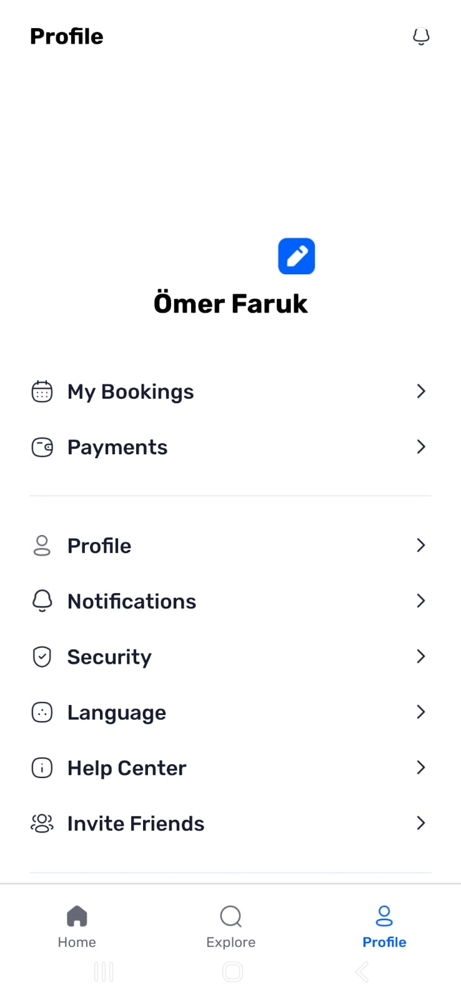
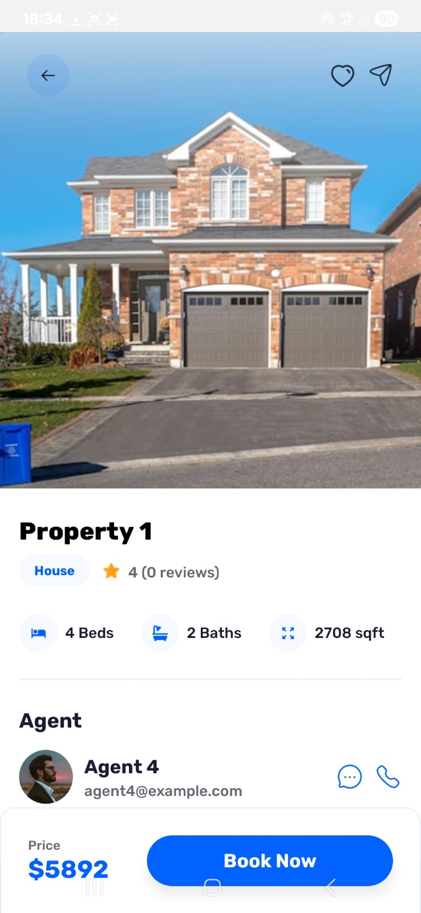
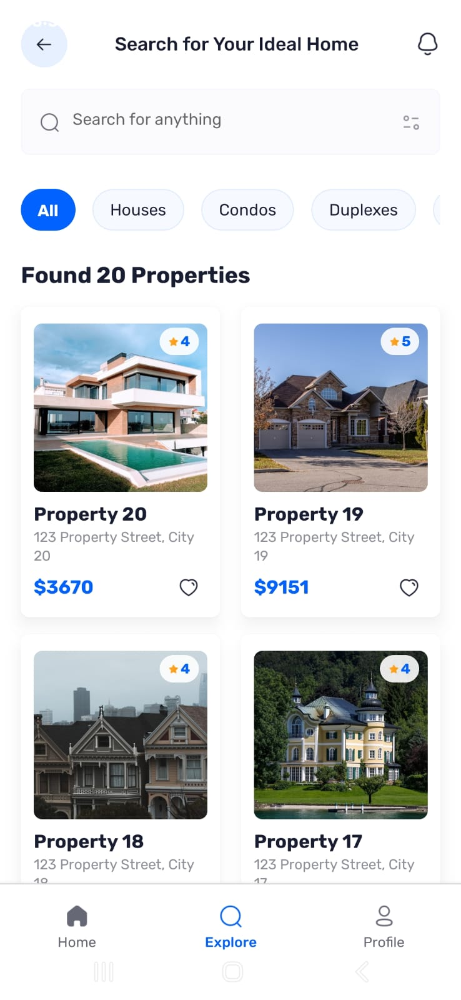
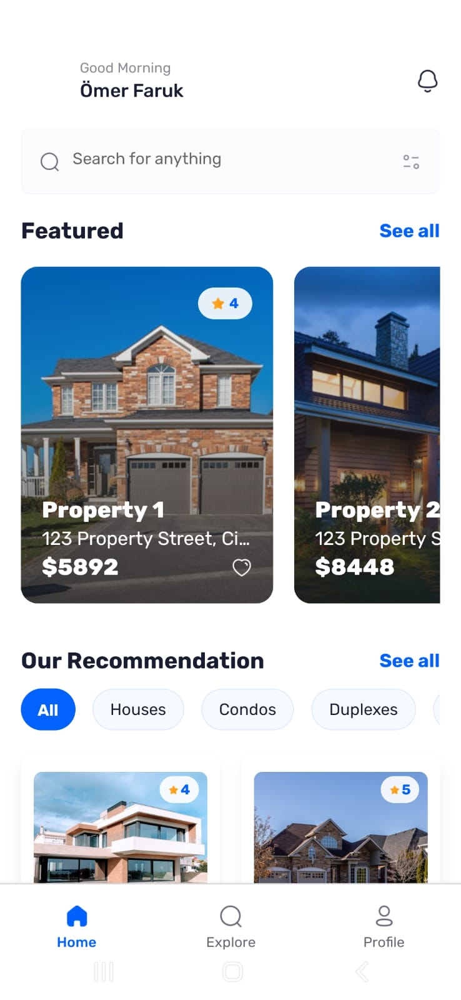

# ReState - Real Estate Mobile App 🏠

A modern React Native real estate application built with Expo Router, featuring property browsing, search functionality, and user authentication.


## 🚀 Features

- **Property Browsing**: Browse through a comprehensive list of properties
- **Advanced Search**: Search properties with filters and location-based queries
- **Property Details**: View detailed property information including images, amenities, and specifications
- **User Authentication**: Secure sign-in functionality
- **Responsive Design**: Optimized for both iOS and Android devices
- **Tab Navigation**: Easy navigation between different sections of the app
- **Real-time Data**: Integration with Appwrite backend for dynamic content

## 📱 Screenshots

<div align="center">
  
  
  
  
</div>

The app includes several key screens:

- **Home**: Featured properties and search functionality
- **Explore**: Browse all available properties
- **Profile**: User profile and settings
- **Property Details**: Comprehensive property information

## 🛠 Tech Stack

- **Framework**: React Native with Expo
- **Navigation**: Expo Router with file-based routing
- **Styling**: NativeWind (Tailwind CSS for React Native)
- **Backend**: Appwrite for data management and authentication
- **Icons**: Expo Vector Icons
- **State Management**: React hooks and custom providers
- **Animation**: React Native Reanimated
- **TypeScript**: Full TypeScript support

## 📋 Prerequisites

Before running this project, make sure you have:

- Node.js (version 16 or higher)
- npm or yarn package manager
- Expo CLI (`npm install -g @expo/cli`)
- iOS Simulator (for iOS development) or Android Emulator (for Android development)
- Expo Go app on your physical device (optional)

## 🔧 Installation

1. **Clone the repository**

   ```bash
   git clone <repository-url>
   cd restate
   ```

2. **Install dependencies**

   ```bash
   npm install
   # or
   yarn install
   ```

3. **Set up environment variables**
   Create a `.env` file in the root directory and add your Appwrite configuration:
   ```env
   EXPO_PUBLIC_APPWRITE_ENDPOINT=your_appwrite_endpoint
   EXPO_PUBLIC_APPWRITE_PROJECT_ID=your_project_id
   EXPO_PUBLIC_APPWRITE_DATABASE_ID=your_database_id
   ```

## 🚀 Running the App

1. **Start the development server**

   ```bash
   npm start
   # or
   yarn start
   ```

2. **Run on specific platforms**

   ```bash
   # iOS
   npm run ios

   # Android
   npm run android

   # Web
   npm run web
   ```

3. **Using Expo Go**
   - Scan the QR code with your device's camera (iOS) or Expo Go app (Android)

## 📁 Project Structure

```
restate/
├── app/                    # App router pages
│   ├── (root)/            # Authenticated routes
│   │   ├── (tabs)/        # Tab navigation
│   │   │   ├── index.tsx  # Home screen
│   │   │   ├── explore.tsx # Explore screen
│   │   │   └── profile.tsx # Profile screen
│   │   └── properties/    # Property details
│   ├── _layout.tsx        # Root layout
│   ├── global.css         # Global styles
│   └── sign-in.tsx        # Authentication screen
├── assets/                # Static assets
│   ├── fonts/            # Custom fonts
│   ├── icons/            # App icons
│   └── images/           # Images and graphics
├── components/           # Reusable components
│   ├── Cards.tsx         # Property cards
│   ├── Comment.tsx       # Comment component
│   ├── Filters.tsx       # Filter component
│   ├── NoResults.tsx     # No results component
│   └── Search.tsx        # Search component
├── constants/            # App constants
│   ├── data.ts          # Static data
│   ├── icons.ts         # Icon mappings
│   └── images.ts        # Image mappings
├── lib/                 # Utilities and providers
│   ├── appwrite.ts      # Appwrite configuration
│   ├── data.ts          # Data utilities
│   ├── global-provider.tsx # Global state provider
│   ├── seed.ts          # Data seeding
│   └── useAppwrite.ts   # Appwrite hooks
└── package.json         # Dependencies
```

## 🎨 Styling

This project uses NativeWind for styling, which allows you to use Tailwind CSS classes in React Native:

```tsx
<View className="flex-1 bg-white p-4">
  <Text className="text-2xl font-bold text-gray-800">Welcome to ReState</Text>
</View>
```

## 🔗 Backend Integration

The app integrates with Appwrite for:

- User authentication
- Property data storage
- Image storage and management
- Real-time updates

Key configuration files:

- `lib/appwrite.ts` - Appwrite client configuration
- `lib/useAppwrite.ts` - Custom hooks for data fetching

## 📱 Features in Detail

### Property Search

- Text-based search functionality
- Location filtering
- Category-based filtering
- Real-time search results

### Property Cards

- Featured property cards with enhanced visuals
- Standard property cards with key information
- Interactive elements for navigation

### Navigation

- File-based routing with Expo Router
- Tab navigation for main sections
- Stack navigation for property details

## 🧪 Development Scripts

```bash
# Start development server
npm start

# Run linting
npm run lint

# Reset project (remove example code)
npm run reset-project

# Platform-specific runs
npm run android
npm run ios
npm run web
```

## 🤝 Contributing

1. Fork the project
2. Create your feature branch (`git checkout -b feature/AmazingFeature`)
3. Commit your changes (`git commit -m 'Add some AmazingFeature'`)
4. Push to the branch (`git push origin feature/AmazingFeature`)
5. Open a Pull Request

## 📄 License

This project is licensed under the MIT License - see the [LICENSE](LICENSE) file for details.

## 📞 Support

If you have any questions or need help with setup, please open an issue in the repository.

---

Built with ❤️ using React Native and Expo
